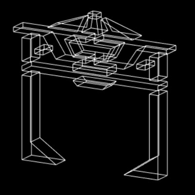
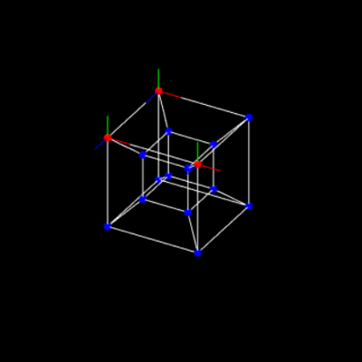

Draw wireframe meshes in the browser. Requires WebGL

[minkcv.github.io/line3d/](https://minkcv.github.io/line3d/)

### Features
- Create, delete, connect, disconnect, and move points
- Rotate, zoom, and pan an orthographic camera
- Saving/loading meshes
- Custom grid snapping
- Mirror about XY plane
- Select multiple points
- Box selection
- Selection copying, extruding, mirroring, and scaling
- Dark and light themes

### TODO
- Export to Wavefront obj
- Better UI/UX

### Screenshots

### Video
https://www.youtube.com/watch?v=5suFU74iWBY